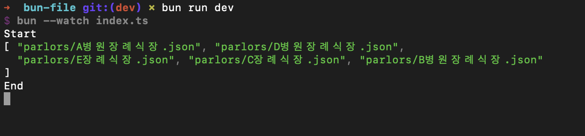
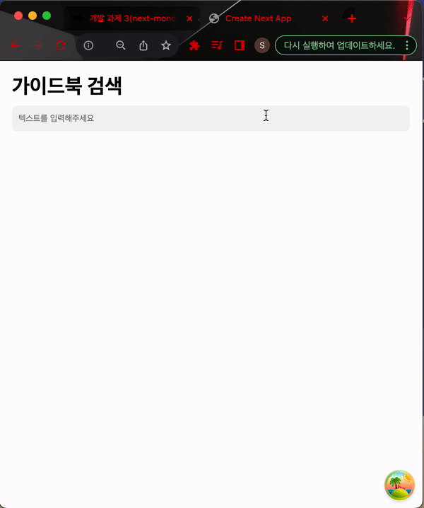
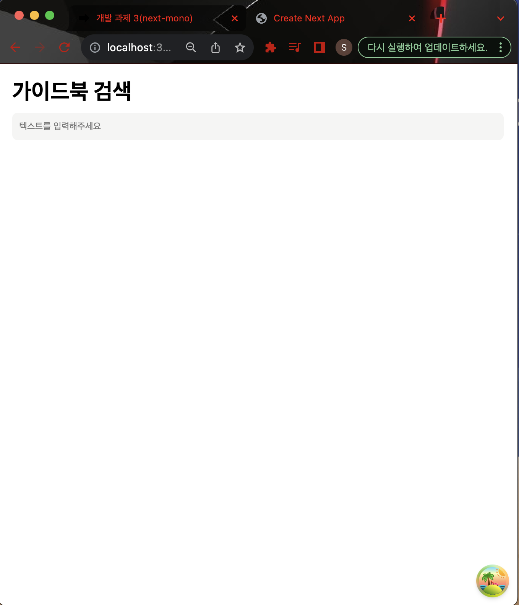
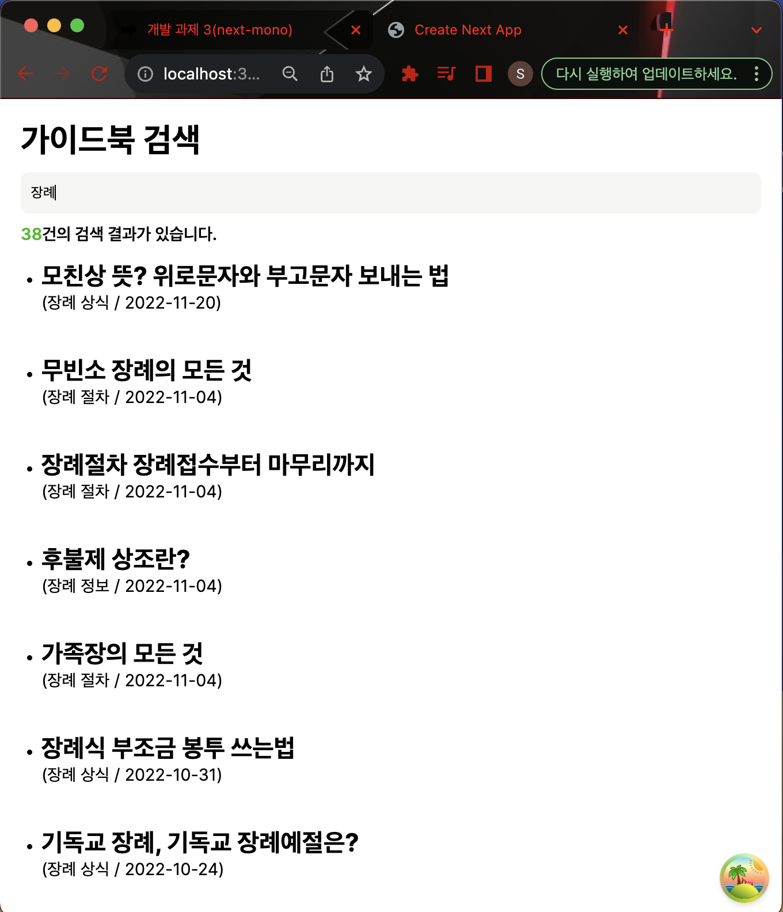

# goi-test-repository
dev.김섭우

# 사용한 툴

- Visual Studio Code - 코드 에디터
- Github Desktop - 깃 리포지토리 관리
- SourceTree - 깃 리포지토리 관리 및 브랜치 병합에 사용

# 1번 과제

# 2번 과제

### memoir

> Bun js 는 node js 를 대체할 Javascript 런타임으로 각광 받는 맥가이버와 같은 신생 런타임이라고 듣고는 있었습니다만, 
> 처음 사용해보았지만 과제를 위해 Docs를 읽거나 현황에 대해 조사하는건 재미있는 경험이였습니다.
> 

### 실행

- path : **goi-test-repository/bun-file**

```tsx
// 실행
bun run dev // 과제 프로젝트 실행

```

### Result



- 과제 1) bun을 설치 후 init 명령어로 프로젝트를 생성해주세요. (완료)
- 과제 2) **package.json의 script 설정**으로 터미널에 **bun dev**를 입력했을 시, index.ts 파일을 실행시키게 해주세요. (완료)
    - Bun js 공식 Docs에 명시된 대로 Bun js는 HMR(Hot Module Reload)을 지원하고 nodemon을 사용할 필요없이 간단한 스크립트 작성으로 리로드 해주었습니다.
    - 참고한 Docs : https://bun.sh/docs/runtime/hot
    - bun-file/package.json
    
    ```tsx
    {
      "name": "bun-file",
      "module": "index.ts",
      "type": "module",
      "scripts":{
        "dev": "bun --watch index.ts"
      },
      "devDependencies": {
        "bun-types": "latest"
      },
      "peerDependencies": {
        "typescript": "^5.0.0"
      }
    }
    ```
    
- 과제 3) 아래 코드부터 **bun init으로 만든 프로젝트**의 **index.ts**에 붙여 넣으신 후 “이곳에 작성해주세요.”를 안내에 따라 채워주세요. (완료)
    - bun-file/index.ts
    
    ```tsx
    import { getFiles } from "./utils/getFiles";
    console.log("Start");
    
    // 1. bun으로 파일 읽기
    // 제공해드린 test-parlors.json를
    // Bun의 메서드를 사용해 읽어주고, 변수에 선언해주세요.
    
    const path = "./constants/test-parlors.json";
    // 이곳에 작성해주세요.
    let originalFile = Bun.file(path);
    
    // 2. 파일 존재 여부 확인
    // Bun의 파일 메서드를 활용해서, 1에서 선언된 변수 내
    // 파일이 없으면 콘솔에 "파일이 없습니다."라는 에러를 띄워주세요.
    
    // 이곳에 작성해주세요.
    if(originalFile.size === 0){
        console.log('파일이 없습니다.')
    }
    
    // 3. JSON 파일 읽기
    // Bun의 파일 메서드를 사용해, 1에서 선언된 변수에 JSON을 자바스크립트의 자료구조로 파싱해주세요.
    
    // 이곳에 작성해주세요.
    const fileList = await originalFile.json()
    
    // 4. 개별 json 저장
    // 3에서 불러온 test-parlors.json의 자바스크립트 자료구조 값들을
    // 반복문, map 메서드 등을 통해, Bun의 파일 메서드를 사용해 개별 파일로 
    // parlors 디렉토리에 저장해주세요.
    // 이때 개별 json의 결과로는 
    // {
    //   "장례식장 타입" : {기존 test-parlors.json의 managed_type의 값},
    //   "주소" : {기존 test-parlors.json의 address의 값}
    // } 
    // 와 같이 한글이름의 키값과 기존 결과를 지정해주시고,
    // 개별 json의 파일명은, 기존 test-parlors.json의 companyname의 값으로 저장해주세요.
    // ex) A병원장례식장.json, B병원장례식장.json ...
    
    // 이곳에 작성해주세요.
    for await(let file of fileList){
        const fileName = file.companyname
        const fileData = {
            "장례식장 타입" : file.managed_type,
            "주소" : file.address
        }
        const filePath = `./parlors/${fileName}.json`
    
        await Bun.write(filePath, JSON.stringify(fileData))
    }
    
    // 5. 개별 json 리스트 출력
    // utils의 getFiles를 사용해, parlors 디렉토리의 분리된 개별 장례식장.json 목록을 불러와주세요.
    // 불러온 목록을 console에 출력해주세요.
    // 콘솔에 parlors 장례식장 분할된 json 5개가 출력되면 통과입니다.
    
    // 이곳에 작성해주세요.
    const paths = await getFiles('./parlors')
    
    console.log(paths);
    
    console.log("End");
    ```
    

### directories

```tsx

├── README.md
├── bun.lockb
├── constants
│   └── test-parlors.json
├── index.ts
├── node_modules
├── package.json
├── parlors
│   ├── A병원장례식장.json
│   ├── B병원장례식장.json
│   ├── C장례식장.json
│   ├── D병원장례식장.json
│   └── E장례식장.json
├── tsconfig.json
└── utils
    └── getFiles.ts

22 directories, 126 files
```

---

# 3번 과제

### memoir

> next js 를 사용하는 것은 기존 CRA에 비해 익숙치 않아 조사를 진행하며 과제를 진행하였습니다.
> useInfiniteQuery 또한 사용해보지 않았지만
> 이번 기회를 통해 조사하며 사용해보고 좋은 경험을 쌓은 것 같습니다.
> next js의 latest 버전의 경우 (과제 진행일 2023.11.08일자 기준) 14버전으로 기존에 _app.tsx가 존재하지 않아 버전 업에 따른 리마인드용 학습이 필수적이라는 생각을 하였습니다.
> 



- 과제 1) [프로젝트 세팅] : 메인 디렉토리 내에 두 개의 서브 디렉토리를 두고 메인 디렉토리에서 명령어를 통하여 각각의 서브 디렉토리에서 next.js 프로젝트가 실행될 수 있도록 해주세요
    - 메인 디렉토리가 되는 ‘next-mono’ 디렉토리 내부에 package.json 에 script 커멘드를 추가하였습니다.
        - 루트 디렉토리에서 두 가지 프로젝트를 실행할 수 있게 스크립트를 추가해본 것은 처음 경험해보아서 정확하게 추가한 것인지는 모르겠지만 조사하며 재미있는 경험이였다고 생각합니다.
        - next-mono/package.json
        
        ```tsx
        {
          "name": "next-mono",
          "version": "1.0.0",
          "description": "next-mono",
          "main": "index.js",
          "scripts": {
            "test": "echo \"Error: no test specified\" && exit 1",
            "dev:goi-test": "cd goi-test && yarn dev",
            "dev:next-default": "cd next-default && yarn dev"
          },
          "author": "seobisback",
          "license": "MIT"
        }
        ```
        
- 과제 2) **[구현] :** 1번 과제의 `dev:goi-test` 명령어를 실행하여 다음 요구 사항을 확인할 수 있도록 구현해주세요.
    - [http://localhost:3000/guidebook](http://localhost:3000/guidebook/search?keyword=%EC%9E%A5%EB%A1%80)
    
    
    
    - [http://localhost:3000/guidebook/search?keyword=장례](http://localhost:3000/guidebook/search?keyword=%EC%9E%A5%EB%A1%80)
    
    
    
    - @tanstack/react-query - useInfiniteQuery
        - goi-test-repository/next-mono/goi-test/app/guidebook/search/page.tsx
        
        ```tsx
        const {
                data,
                fetchNextPage,
              } = useInfiniteQuery({
                queryKey: ['searchData', keyword],
                queryFn: ({ pageParam }) => getSearchResult({searchKeyword: keyword ? keyword : '', pageParam}),
                initialPageParam: 1,
                getNextPageParam: (lastPage: {count: number, next: null | string, previous: null | string, results: []}) => {
                    if (lastPage && lastPage.next){
                        const url = lastPage.next
                        const urlParams = new URLSearchParams(new URL(url).search);
                        const page = urlParams.get("page");
        
                        return Number(page)
                    }
                    return null
                }
            })
        ```
        

### 설치 및 실행

- 종속성 라이브러리 설치 및 실행
- path : **goi-test-repository/next-mono**

```tsx
// 종속성 설치
cd goi-test // 과제 프로젝트 디렉토리로 이동
npm install | yarn install // npm 혹은 yarn을 사용해 종속성 라이브러리 설치
cd .. // next-mono 디렉토리로 이동

// 실행
yarn dev:goi-test // 과제 프로젝트 실행
yarn dev:next-default // 기본 next js 초기 프로젝트 실행

```

### directories

- next-mono/goi-test/app

```tsx
.
├── favicon.ico
├── globals.css
├── guidebook
│   ├── layout.module.css
│   ├── layout.tsx
│   ├── page.tsx
│   └── search
│       ├── page.module.css
│       └── page.tsx
├── hooks
│   └── useInfiniteScroll.ts
├── layout.tsx
├── page.module.css
├── page.tsx
└── queries
    └── getSearchResult.ts

5 directories, 12 files
```

### next-mono/goi-test/package.json

```tsx
{
  "name": "goi-test",
  "version": "0.1.0",
  "private": true,
  "scripts": {
    "dev": "next dev",
    "build": "next build",
    "start": "next start",
    "lint": "next lint"
  },
  "dependencies": {
    "@tanstack/react-query": "^5.7.2",
    "@tanstack/react-query-devtools": "^5.7.4",
    "next": "14.0.1",
    "react": "^18",
    "react-dom": "^18"
  },
  "devDependencies": {
    "@types/node": "^20",
    "@types/react": "^18",
    "@types/react-dom": "^18",
    "eslint": "^8",
    "eslint-config-next": "14.0.1",
    "typescript": "^5"
  }
}
```